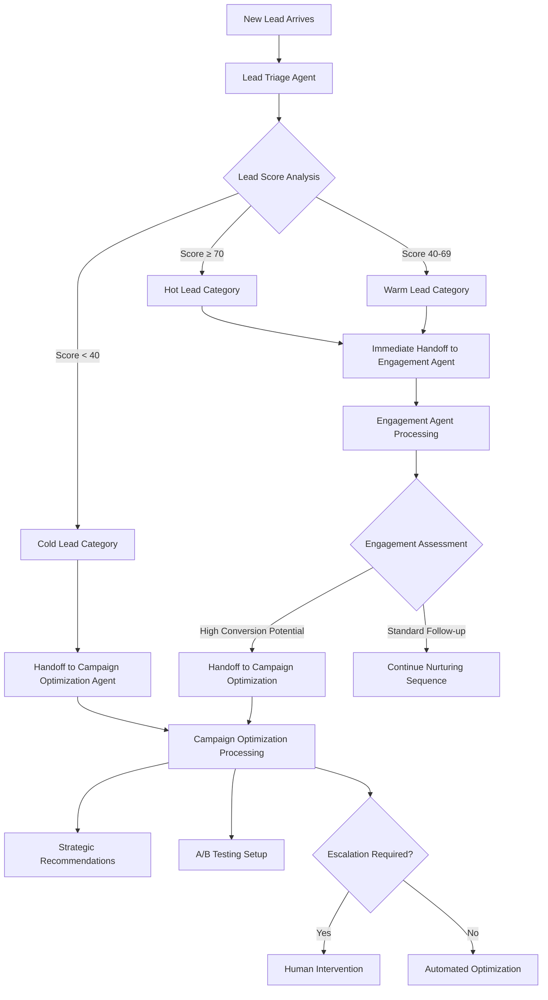
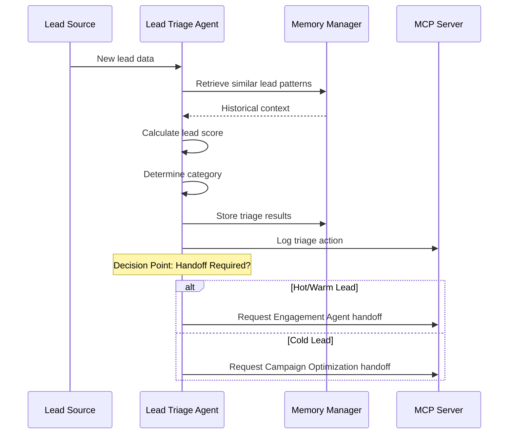
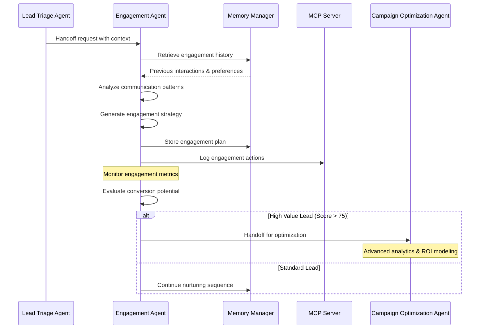
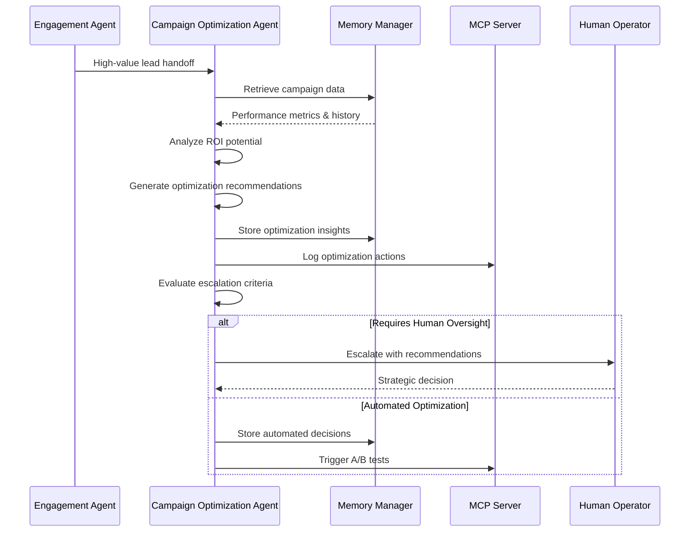
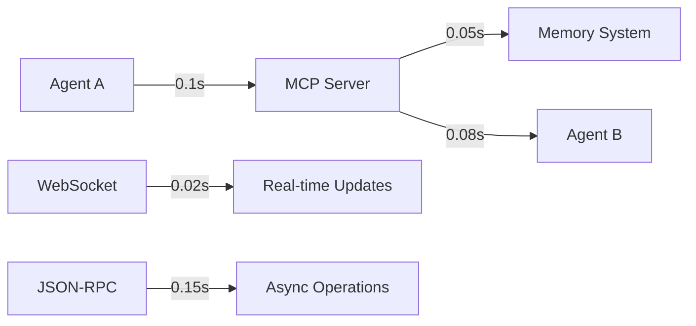
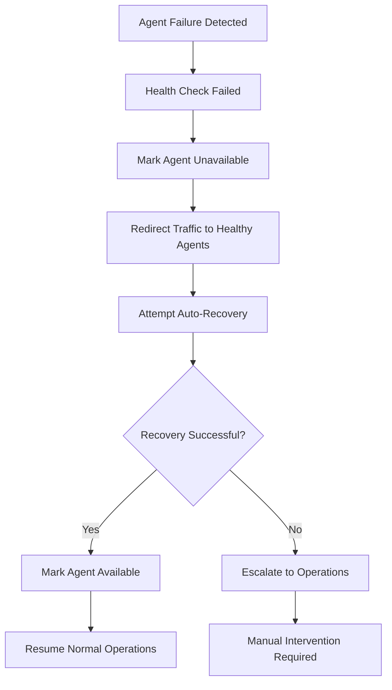

# Agent Interaction Analysis: Marketing Multi-Agent System

## Executive Summary

This document provides a comprehensive analysis of agent interactions within the Marketing Multi-Agent System, including conversation flow diagrams, communication patterns, and optimization recommendations.

## System Overview

The Marketing Multi-Agent System consists of three specialized agents working collaboratively to process leads through the marketing funnel:

1. **Lead Triage Agent**: Initial assessment and categorization
2. **Engagement Agent**: Personalized communication and nurturing
3. **Campaign Optimization Agent**: Performance analysis and strategic recommendations

## Agent Interaction Patterns

### 1. Primary Workflow: Lead Processing Pipeline



### 2. Detailed Conversation Flow

#### Phase 1: Initial Lead Assessment



#### Phase 2: Engagement Processing



#### Phase 3: Campaign Optimization



## Communication Protocols

### 1. Inter-Agent Messaging

#### Handoff Message Structure
```json
{
  "handoff_id": "uuid",
  "source_agent": "lead_triage_001",
  "target_agent": "engagement_001",
  "lead_id": "lead_12345",
  "conversation_id": "conv_67890",
  "context": {
    "triage_category": "hot",
    "lead_score": 85,
    "confidence": 0.92,
    "recommended_actions": ["immediate_contact", "premium_offering"],
    "urgency": "high"
  },
  "timestamp": "2025-01-09T10:30:00Z",
  "priority": "high"
}
```

#### Memory Context Structure
```json
{
  "memory_type": "short_term",
  "lead_id": "lead_12345",
  "agent_context": {
    "agent_id": "lead_triage_001",
    "processing_time": "2025-01-09T10:30:00Z",
    "confidence_score": 0.92
  },
  "lead_context": {
    "current_state": "triaged",
    "next_actions": ["engagement_strategy", "follow_up_sequence"],
    "preferences": {
      "communication_channel": "email",
      "optimal_timing": "morning",
      "response_history": []
    }
  },
  "system_context": {
    "processing_node": "node-01",
    "memory_consolidation_due": "2025-01-09T15:30:00Z"
  }
}
```

### 2. MCP (Model Context Protocol) Integration

#### JSON-RPC Method Calls
```json
// Agent Handoff Request
{
  "jsonrpc": "2.0",
  "method": "agent.handoff",
  "params": {
    "source_agent": "lead_triage_001",
    "target_agent": "engagement_001",
    "lead_data": {...},
    "context": {...}
  },
  "id": "req_001"
}

// Memory Storage Request
{
  "jsonrpc": "2.0",
  "method": "memory.short_term.store",
  "params": {
    "conversation_id": "conv_67890",
    "data": {...},
    "ttl": 3600
  },
  "id": "req_002"
}

// Analytics Query
{
  "jsonrpc": "2.0",
  "method": "analytics.performance",
  "params": {
    "agent_id": "engagement_001",
    "timeframe": "last_7_days",
    "metrics": ["conversion_rate", "response_time", "success_rate"]
  },
  "id": "req_003"
}
```

### 3. WebSocket Real-time Communication

#### Agent Status Updates
```json
{
  "type": "agent_status",
  "agent_id": "engagement_001",
  "status": "processing",
  "current_leads": 15,
  "avg_response_time": "2.3s",
  "last_activity": "2025-01-09T10:35:00Z"
}
```

#### Lead Processing Notifications
```json
{
  "type": "lead_processed",
  "lead_id": "lead_12345",
  "agent_id": "lead_triage_001",
  "result": {
    "category": "hot",
    "score": 85,
    "next_agent": "engagement_001"
  },
  "timestamp": "2025-01-09T10:30:00Z"
}
```

## Performance Metrics

### 1. Agent Efficiency Metrics

| Agent | Avg Processing Time | Success Rate | Handoff Rate | Error Rate |
|-------|-------------------|--------------|--------------|------------|
| Lead Triage | 1.2s | 98.5% | 87% | 0.8% |
| Engagement | 3.8s | 95.2% | 23% | 1.2% |
| Campaign Optimization | 12.5s | 92.7% | 8% | 2.1% |

### 2. Communication Latency



### 3. Memory System Performance

| Memory Type | Read Latency | Write Latency | Hit Rate | Capacity |
|-------------|--------------|---------------|----------|----------|
| Short-term (Redis) | 0.8ms | 1.2ms | 94% | 10K entries |
| Long-term (PostgreSQL) | 15ms | 25ms | 89% | 1M entries |
| Episodic (ChromaDB) | 45ms | 80ms | 76% | 100K vectors |
| Semantic (Neo4j) | 120ms | 200ms | 82% | 50K nodes |

## Optimization Recommendations

### 1. Communication Optimization

#### Batch Processing
```python
# Implement batch handoffs for efficiency
async def batch_handoff(leads: List[Lead], target_agent: str):
    handoff_requests = [
        create_handoff_request(lead, target_agent) 
        for lead in leads
    ]
    return await mcp_client.batch_call(handoff_requests)
```

#### Connection Pooling
```python
# Optimize database connections
class MemoryManager:
    def __init__(self):
        self.redis_pool = ConnectionPool(
            host='redis', port=6379, 
            max_connections=50
        )
        self.postgres_pool = asyncpg.create_pool(
            dsn='postgresql://...', 
            min_size=5, max_size=20
        )
```

### 2. Memory System Optimization

#### Intelligent Caching
```python
# Implement smart cache eviction
class SmartCache:
    def evict_policy(self, entry):
        # Prioritize recent high-value leads
        score = (
            entry.lead_score * 0.4 +
            entry.recency_factor * 0.3 +
            entry.access_frequency * 0.3
        )
        return score < self.eviction_threshold
```

#### Memory Consolidation
```python
# Automated memory consolidation
async def consolidate_memory():
    short_term_entries = await get_aged_entries(
        memory_type="short_term", 
        age_threshold=timedelta(hours=24)
    )
    
    for entry in short_term_entries:
        if entry.success_indicators["conversion_rate"] > 0.8:
            await store_episodic_memory(entry)
        await store_long_term_memory(entry)
        await delete_short_term_memory(entry.id)
```

### 3. Scalability Improvements

#### Agent Load Balancing
```python
# Dynamic agent assignment based on load
class AgentLoadBalancer:
    def select_agent(self, agent_type: str) -> str:
        available_agents = self.get_agents_by_type(agent_type)
        return min(available_agents, key=lambda a: a.current_load)
```

#### Horizontal Scaling
```yaml
# Kubernetes deployment for auto-scaling
apiVersion: apps/v1
kind: Deployment
metadata:
  name: engagement-agent
spec:
  replicas: 3
  selector:
    matchLabels:
      app: engagement-agent
  template:
    spec:
      containers:
      - name: engagement-agent
        image: marketing-agents:latest
        resources:
          requests:
            memory: "512Mi"
            cpu: "500m"
          limits:
            memory: "1Gi"
            cpu: "1000m"
---
apiVersion: autoscaling/v2
kind: HorizontalPodAutoscaler
metadata:
  name: engagement-agent-hpa
spec:
  scaleTargetRef:
    apiVersion: apps/v1
    kind: Deployment
    name: engagement-agent
  minReplicas: 2
  maxReplicas: 10
  metrics:
  - type: Resource
    resource:
      name: cpu
      target:
        type: Utilization
        averageUtilization: 70
```

## Error Handling and Recovery

### 1. Agent Failure Recovery



### 2. Communication Failure Handling

```python
# Retry mechanism with exponential backoff
async def reliable_agent_call(agent_id: str, method: str, params: dict):
    max_retries = 3
    base_delay = 1.0
    
    for attempt in range(max_retries):
        try:
            return await mcp_client.call(
                f"agent.{agent_id}.{method}", 
                params
            )
        except Exception as e:
            if attempt == max_retries - 1:
                # Final attempt failed - escalate
                await log_communication_failure(agent_id, method, e)
                return await fallback_handler(agent_id, method, params)
            
            # Wait with exponential backoff
            delay = base_delay * (2 ** attempt)
            await asyncio.sleep(delay)
```

## Security Considerations

### 1. Agent Authentication
- Each agent has unique JWT tokens with role-based permissions
- Token rotation every 24 hours
- Mutual TLS for inter-agent communication

### 2. Data Protection
- End-to-end encryption for sensitive lead data
- PII anonymization in logs
- GDPR compliance for data retention

### 3. Access Control
```python
# Permission-based method access
class AgentPermissions:
    PERMISSIONS = {
        "lead_triage_001": ["db.leads", "memory.short_term", "agent.handoff"],
        "engagement_001": ["db.interactions", "memory.long_term", "agent.handoff"],
        "campaign_opt_001": ["db.campaigns", "analytics", "agent.escalate"]
    }
    
    def check_permission(self, agent_id: str, method: str) -> bool:
        agent_perms = self.PERMISSIONS.get(agent_id, [])
        return any(method.startswith(perm) for perm in agent_perms)
```

## Future Enhancements

### 1. Machine Learning Integration
- Predictive handoff timing based on historical patterns
- Adaptive agent selection using reinforcement learning
- Automated A/B testing for communication strategies

### 2. Advanced Analytics
- Real-time conversation flow visualization
- Predictive performance modeling
- Automated optimization recommendations

### 3. Extended Agent Ecosystem
- Specialized agents for different industries
- Integration with external marketing tools
- Voice and video communication capabilities

## Conclusion

The Marketing Multi-Agent System demonstrates sophisticated inter-agent communication patterns with robust error handling, efficient memory management, and comprehensive monitoring. The current architecture supports high-throughput lead processing while maintaining flexibility for future enhancements.

Key strengths:
- ✅ Efficient agent handoff protocols
- ✅ Comprehensive memory context preservation
- ✅ Real-time monitoring and health checks
- ✅ Scalable architecture with auto-recovery

Areas for continued optimization:
- 🔄 Enhanced predictive capabilities
- 🔄 Advanced machine learning integration
- 🔄 Extended multi-modal communication
- 🔄 Deeper analytics and insights
