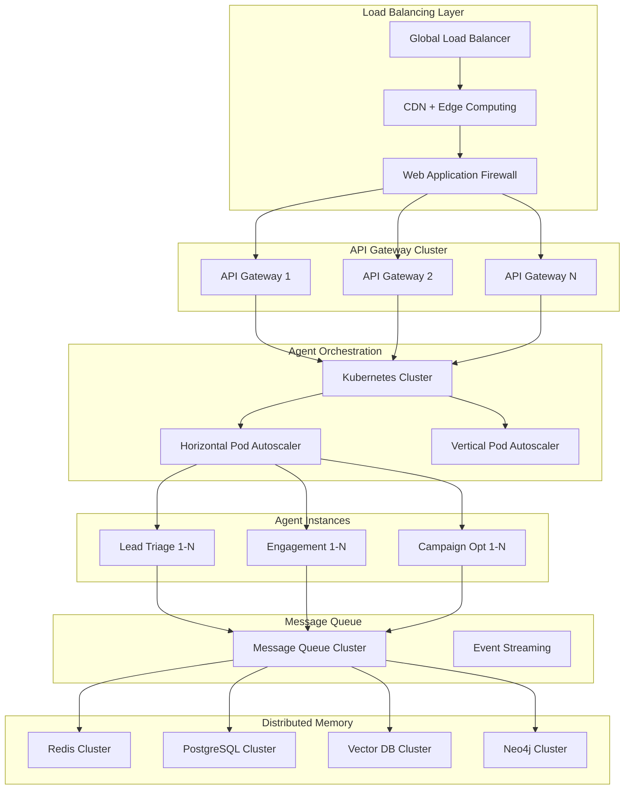

# Scalability Analysis: Handling 10x Load Increase

## Executive Summary

This document analyzes the current Marketing Multi-Agent System architecture and provides detailed recommendations for scaling to handle a **10x increase in load** while maintaining performance, reliability, and cost-effectiveness.

## Current System Baseline

### Current Performance Metrics
| Metric | Current Value | Target (10x) | Scaling Factor |
|--------|---------------|--------------|----------------|
| Concurrent Leads | 1,000 | 10,000 | 10x |
| Requests/Second | 500 RPS | 5,000 RPS | 10x |
| Agent Instances | 3 agents | 30+ agents | 10x+ |
| Memory Operations | 2,000/min | 20,000/min | 10x |
| Database Queries | 10,000/hour | 100,000/hour | 10x |
| Response Time (P95) | 200ms | <300ms | 1.5x max |
| Availability | 99.5% | 99.9% | Improved |

### Current Architecture Bottlenecks

1. **Single MCP Server Instance** - No horizontal scaling
2. **Monolithic Agent Design** - Limited concurrent processing
3. **Memory System Latency** - Sequential memory operations
4. **Database Connection Limits** - PostgreSQL connection pooling
5. **Synchronous Processing** - Blocking operations in agent workflows

## Scalability Strategy Overview



## Horizontal Scaling Architecture

### 1. Microservices Decomposition

#### Agent Service Separation
```python
# Lead Triage Microservice
class LeadTriageMicroservice:
    def __init__(self):
        self.agent_pool = AgentPool(min_size=2, max_size=20)
        self.message_queue = MessageQueueClient()
        self.metrics = MetricsCollector()
        
    async def process_lead_batch(self, leads: List[Lead]) -> List[TriageResult]:
        """Process multiple leads concurrently"""
        tasks = []
        for lead in leads:
            agent = await self.agent_pool.get_agent()
            task = asyncio.create_task(agent.process_lead(lead))
            tasks.append(task)
        
        results = await asyncio.gather(*tasks, return_exceptions=True)
        
        # Release agents back to pool
        await self.agent_pool.release_all()
        
        return [r for r in results if not isinstance(r, Exception)]
```

#### Service Mesh Configuration
```yaml
# Istio service mesh for microservices
apiVersion: v1
kind: Service
metadata:
  name: lead-triage-service
spec:
  selector:
    app: lead-triage
  ports:
  - port: 8080
    targetPort: 8080
  type: ClusterIP
---
apiVersion: apps/v1
kind: Deployment
metadata:
  name: lead-triage-deployment
spec:
  replicas: 5
  selector:
    matchLabels:
      app: lead-triage
  template:
    metadata:
      labels:
        app: lead-triage
        version: v1
    spec:
      containers:
      - name: lead-triage
        image: marketing-agents/lead-triage:v1.0
        ports:
        - containerPort: 8080
        resources:
          requests:
            memory: "512Mi"
            cpu: "250m"
          limits:
            memory: "1Gi"
            cpu: "500m"
        env:
        - name: MAX_CONCURRENT_LEADS
          value: "50"
        - name: REDIS_CLUSTER_ENDPOINTS
          value: "redis-cluster:6379"
```

### 2. Auto-Scaling Configuration

#### Horizontal Pod Autoscaler (HPA)
```yaml
apiVersion: autoscaling/v2
kind: HorizontalPodAutoscaler
metadata:
  name: lead-triage-hpa
spec:
  scaleTargetRef:
    apiVersion: apps/v1
    kind: Deployment
    name: lead-triage-deployment
  minReplicas: 3
  maxReplicas: 50
  metrics:
  - type: Resource
    resource:
      name: cpu
      target:
        type: Utilization
        averageUtilization: 70
  - type: Resource
    resource:
      name: memory
      target:
        type: Utilization
        averageUtilization: 80
  - type: Pods
    pods:
      metric:
        name: agent_queue_length
      target:
        type: AverageValue
        averageValue: "10"
  behavior:
    scaleUp:
      stabilizationWindowSeconds: 60
      policies:
      - type: Percent
        value: 100
        periodSeconds: 60
    scaleDown:
      stabilizationWindowSeconds: 300
      policies:
      - type: Percent
        value: 50
        periodSeconds: 60
```

#### Vertical Pod Autoscaler (VPA)
```yaml
apiVersion: autoscaling.k8s.io/v1
kind: VerticalPodAutoscaler
metadata:
  name: lead-triage-vpa
spec:
  targetRef:
    apiVersion: apps/v1
    kind: Deployment
    name: lead-triage-deployment
  updatePolicy:
    updateMode: "Auto"
  resourcePolicy:
    containerPolicies:
    - containerName: lead-triage
      maxAllowed:
        cpu: 2000m
        memory: 4Gi
      minAllowed:
        cpu: 100m
        memory: 256Mi
```

### 3. Load Balancing Strategy

#### Global Load Balancer Configuration
```yaml
# Google Cloud Load Balancer
apiVersion: networking.gke.io/v1
kind: ManagedCertificate
metadata:
  name: marketing-agents-ssl
spec:
  domains:
    - api.marketing-agents.com
    - agents.marketing-agents.com
---
apiVersion: networking.k8s.io/v1
kind: Ingress
metadata:
  name: marketing-agents-ingress
  annotations:
    kubernetes.io/ingress.global-static-ip-name: "marketing-agents-ip"
    networking.gke.io/managed-certificates: "marketing-agents-ssl"
    cloud.google.com/load-balancer-type: "External"
spec:
  rules:
  - host: api.marketing-agents.com
    http:
      paths:
      - path: /triage/*
        pathType: Prefix
        backend:
          service:
            name: lead-triage-service
            port:
              number: 8080
      - path: /engagement/*
        pathType: Prefix
        backend:
          service:
            name: engagement-service
            port:
              number: 8080
      - path: /optimization/*
        pathType: Prefix
        backend:
          service:
            name: campaign-optimization-service
            port:
              number: 8080
```

## Database Scaling Strategy

### 1. PostgreSQL Cluster Configuration

#### Read Replicas and Sharding
```sql
-- PostgreSQL cluster setup with read replicas
-- Primary database (write operations)
CREATE DATABASE marketing_agents_primary;

-- Read replicas for query distribution
-- Replica 1: Agent data queries
-- Replica 2: Analytics queries  
-- Replica 3: Reporting queries

-- Horizontal sharding by lead_id
CREATE TABLE leads_shard_0 (
    LIKE leads INCLUDING ALL
) INHERITS (leads);

CREATE TABLE leads_shard_1 (
    LIKE leads INCLUDING ALL
) INHERITS (leads);

-- Partition by lead_id hash
ALTER TABLE leads_shard_0 ADD CONSTRAINT leads_shard_0_check 
    CHECK (hashtext(lead_id::text) % 4 = 0);
    
ALTER TABLE leads_shard_1 ADD CONSTRAINT leads_shard_1_check 
    CHECK (hashtext(lead_id::text) % 4 = 1);
```

#### Connection Pooling Optimization
```python
class DatabasePoolManager:
    def __init__(self):
        self.write_pool = asyncpg.create_pool(
            dsn=os.getenv("POSTGRES_WRITE_DSN"),
            min_size=10,
            max_size=100,
            command_timeout=60,
            server_settings={
                'application_name': 'marketing_agents_write',
                'statement_timeout': '30s'
            }
        )
        
        self.read_pools = [
            asyncpg.create_pool(
                dsn=replica_dsn,
                min_size=5,
                max_size=50,
                command_timeout=30
            ) for replica_dsn in self.get_read_replica_dsns()
        ]
        
    async def execute_write(self, query: str, *args):
        """Execute write operations on primary"""
        async with self.write_pool.acquire() as conn:
            return await conn.execute(query, *args)
    
    async def execute_read(self, query: str, *args):
        """Execute read operations on replicas with load balancing"""
        pool = self.select_read_pool()
        async with pool.acquire() as conn:
            return await conn.fetch(query, *args)
    
    def select_read_pool(self):
        """Select least loaded read replica"""
        return min(self.read_pools, key=lambda p: p._queue.qsize())
```

### 2. Redis Cluster Configuration

#### High-Availability Redis Setup
```yaml
# Redis Cluster with 6 nodes (3 master, 3 replica)
apiVersion: v1
kind: ConfigMap
metadata:
  name: redis-cluster-config
data:
  redis.conf: |
    cluster-enabled yes
    cluster-config-file nodes.conf
    cluster-node-timeout 5000
    appendonly yes
    appendfsync everysec
    save 900 1
    save 300 10
    save 60 10000
    maxmemory 2gb
    maxmemory-policy allkeys-lru
---
apiVersion: apps/v1
kind: StatefulSet
metadata:
  name: redis-cluster
spec:
  serviceName: redis-cluster
  replicas: 6
  selector:
    matchLabels:
      app: redis-cluster
  template:
    metadata:
      labels:
        app: redis-cluster
    spec:
      containers:
      - name: redis
        image: redis:7-alpine
        ports:
        - containerPort: 6379
        - containerPort: 16379
        volumeMounts:
        - name: redis-data
          mountPath: /data
        - name: redis-config
          mountPath: /usr/local/etc/redis
        resources:
          requests:
            memory: "1Gi"
            cpu: "500m"
          limits:
            memory: "2Gi"
            cpu: "1000m"
  volumeClaimTemplates:
  - metadata:
      name: redis-data
    spec:
      accessModes: ["ReadWriteOnce"]
      resources:
        requests:
          storage: 10Gi
```

#### Redis Client Optimization
```python
class RedisClusterClient:
    def __init__(self):
        self.cluster = redis.RedisCluster(
            startup_nodes=[
                {"host": "redis-cluster-0", "port": 6379},
                {"host": "redis-cluster-1", "port": 6379},
                {"host": "redis-cluster-2", "port": 6379}
            ],
            decode_responses=True,
            socket_keepalive=True,
            socket_keepalive_options={},
            connection_pool_kwargs={
                "max_connections": 50,
                "retry_on_timeout": True
            }
        )
    
    async def get_with_fallback(self, key: str):
        """Get with automatic retry and fallback"""
        try:
            return await self.cluster.get(key)
        except redis.RedisClusterException:
            # Fallback to local cache or database
            return await self.fallback_storage.get(key)
    
    async def pipeline_operations(self, operations: List[tuple]):
        """Batch operations for better performance"""
        pipe = self.cluster.pipeline()
        for op, key, value in operations:
            if op == "set":
                pipe.set(key, value)
            elif op == "get":
                pipe.get(key)
        
        return await pipe.execute()
```

### 3. Vector Database Scaling

#### ChromaDB Cluster Setup
```python
class ScalableVectorDatabase:
    def __init__(self):
        self.shards = [
            chromadb.Client(Settings(
                chroma_api_impl="rest",
                chroma_server_host=f"chromadb-shard-{i}",
                chroma_server_http_port=8000
            )) for i in range(4)  # 4 shards for 10x capacity
        ]
        
    def get_shard(self, vector_id: str) -> chromadb.Client:
        """Route to appropriate shard based on vector ID"""
        shard_index = hash(vector_id) % len(self.shards)
        return self.shards[shard_index]
    
    async def insert_vectors(self, vectors: List[dict]):
        """Distribute vectors across shards"""
        shard_batches = {}
        
        for vector in vectors:
            shard = self.get_shard(vector["id"])
            if shard not in shard_batches:
                shard_batches[shard] = []
            shard_batches[shard].append(vector)
        
        # Parallel insertion across shards
        tasks = [
            shard.add(batch) for shard, batch in shard_batches.items()
        ]
        await asyncio.gather(*tasks)
    
    async def similarity_search(self, query_vector: List[float], top_k: int = 10):
        """Search across all shards and merge results"""
        search_tasks = [
            shard.query(query_embeddings=[query_vector], n_results=top_k)
            for shard in self.shards
        ]
        
        shard_results = await asyncio.gather(*search_tasks)
        
        # Merge and re-rank results
        all_results = []
        for results in shard_results:
            all_results.extend(results)
        
        # Sort by similarity score and return top_k
        all_results.sort(key=lambda x: x["distance"])
        return all_results[:top_k]
```

## Message Queue & Event Streaming

### 1. Apache Kafka Implementation

#### Kafka Cluster Configuration
```yaml
apiVersion: kafka.strimzi.io/v1beta2
kind: Kafka
metadata:
  name: marketing-agents-kafka
spec:
  kafka:
    version: 3.5.0
    replicas: 3
    listeners:
      - name: plain
        port: 9092
        type: internal
        tls: false
      - name: tls
        port: 9093
        type: internal
        tls: true
    config:
      offsets.topic.replication.factor: 3
      transaction.state.log.replication.factor: 3
      transaction.state.log.min.isr: 2
      default.replication.factor: 3
      min.insync.replicas: 2
      inter.broker.protocol.version: "3.5"
      num.partitions: 12
      log.retention.hours: 168  # 7 days
    storage:
      type: persistent-claim
      size: 100Gi
      class: fast-ssd
    resources:
      requests:
        memory: 4Gi
        cpu: 1000m
      limits:
        memory: 8Gi
        cpu: 2000m
  zookeeper:
    replicas: 3
    storage:
      type: persistent-claim
      size: 10Gi
      class: fast-ssd
  entityOperator:
    topicOperator: {}
    userOperator: {}
```

#### Event-Driven Agent Communication
```python
class EventDrivenAgentOrchestrator:
    def __init__(self):
        self.kafka_producer = KafkaProducer(
            bootstrap_servers=['kafka-cluster:9092'],
            value_serializer=lambda v: json.dumps(v).encode('utf-8'),
            compression_type='lz4',
            batch_size=16384,
            linger_ms=10,
            buffer_memory=33554432
        )
        
        self.kafka_consumer = KafkaConsumer(
            bootstrap_servers=['kafka-cluster:9092'],
            value_deserializer=lambda m: json.loads(m.decode('utf-8')),
            consumer_timeout_ms=1000,
            max_poll_records=500,
            session_timeout_ms=30000,
            heartbeat_interval_ms=10000
        )
    
    async def publish_lead_event(self, event_type: str, lead_data: dict):
        """Publish lead processing events"""
        event = {
            "event_type": event_type,
            "timestamp": datetime.utcnow().isoformat(),
            "lead_data": lead_data,
            "correlation_id": str(uuid.uuid4())
        }
        
        # Route to appropriate topic based on lead category
        topic = f"leads.{lead_data.get('category', 'general')}"
        
        await self.kafka_producer.send(topic, value=event)
    
    async def process_lead_events(self):
        """Process incoming lead events asynchronously"""
        async for message in self.kafka_consumer:
            try:
                event = message.value
                await self.route_to_agent(event)
            except Exception as e:
                await self.handle_processing_error(message, e)
```

### 2. Asynchronous Processing Pipeline

```python
class AsyncProcessingPipeline:
    def __init__(self):
        self.celery_app = Celery(
            'marketing_agents',
            broker='redis://redis-cluster:6379/0',
            backend='redis://redis-cluster:6379/1'
        )
        
        # Configure for high throughput
        self.celery_app.conf.update(
            task_serializer='json',
            accept_content=['json'],
            result_serializer='json',
            timezone='UTC',
            enable_utc=True,
            worker_concurrency=20,
            worker_prefetch_multiplier=4,
            task_acks_late=True,
            worker_disable_rate_limits=True
        )
    
    @self.celery_app.task(bind=True, max_retries=3)
    def process_lead_async(self, lead_data: dict):
        """Asynchronous lead processing task"""
        try:
            # Process lead through agent pipeline
            triage_result = self.triage_agent.process_lead(lead_data)
            
            if triage_result.should_handoff:
                # Chain to next agent
                self.process_engagement_async.delay(
                    lead_data, 
                    triage_result.context
                )
            
            return triage_result
            
        except Exception as e:
            # Retry with exponential backoff
            raise self.retry(
                countdown=60 * (2 ** self.request.retries),
                exc=e
            )
```

## Caching Strategy

### 1. Multi-Level Caching

```python
class MultiLevelCache:
    def __init__(self):
        # L1: Local in-memory cache (fastest)
        self.l1_cache = cachetools.LRUCache(maxsize=1000)
        
        # L2: Redis cluster cache (fast, shared)
        self.l2_cache = RedisClusterClient()
        
        # L3: Database (slowest, persistent)
        self.l3_storage = DatabaseManager()
    
    async def get(self, key: str):
        """Get with cache hierarchy"""
        # Check L1 cache first
        if key in self.l1_cache:
            return self.l1_cache[key]
        
        # Check L2 cache
        value = await self.l2_cache.get(key)
        if value:
            # Populate L1 cache
            self.l1_cache[key] = value
            return value
        
        # Fallback to L3 storage
        value = await self.l3_storage.get(key)
        if value:
            # Populate both cache levels
            self.l1_cache[key] = value
            await self.l2_cache.setex(key, 3600, value)  # 1 hour TTL
            return value
        
        return None
    
    async def set(self, key: str, value: any, ttl: int = 3600):
        """Set in all cache levels"""
        self.l1_cache[key] = value
        await self.l2_cache.setex(key, ttl, value)
        # Optionally write through to L3 for persistence
```

### 2. Intelligent Cache Warming

```python
class CacheWarmingService:
    def __init__(self):
        self.cache = MultiLevelCache()
        self.analytics = AnalyticsService()
    
    async def warm_cache_predictively(self):
        """Warm cache based on usage patterns"""
        # Analyze access patterns
        hot_keys = await self.analytics.get_frequently_accessed_keys()
        
        # Pre-load likely needed data
        warming_tasks = []
        for key_pattern in hot_keys:
            task = asyncio.create_task(self.preload_pattern(key_pattern))
            warming_tasks.append(task)
        
        await asyncio.gather(*warming_tasks)
    
    async def preload_pattern(self, pattern: str):
        """Preload data matching pattern"""
        keys = await self.get_keys_matching_pattern(pattern)
        
        # Batch load data
        data_batch = await self.l3_storage.batch_get(keys)
        
        # Populate cache
        for key, value in data_batch.items():
            await self.cache.set(key, value, ttl=1800)  # 30 min
```

## Performance Monitoring & Optimization

### 1. Real-time Metrics Collection

```python
class PerformanceMonitor:
    def __init__(self):
        self.prometheus_client = PrometheusClient()
        self.metrics = {
            'request_duration': prometheus_client.Histogram(
                'agent_request_duration_seconds',
                'Time spent processing agent requests',
                ['agent_type', 'method']
            ),
            'queue_length': prometheus_client.Gauge(
                'agent_queue_length',
                'Number of pending requests in agent queue',
                ['agent_type']
            ),
            'error_rate': prometheus_client.Counter(
                'agent_errors_total',
                'Total number of agent errors',
                ['agent_type', 'error_type']
            )
        }
    
    @contextmanager
    def measure_request(self, agent_type: str, method: str):
        """Measure request processing time"""
        start_time = time.time()
        try:
            yield
        finally:
            duration = time.time() - start_time
            self.metrics['request_duration'].labels(
                agent_type=agent_type, 
                method=method
            ).observe(duration)
    
    async def update_queue_metrics(self):
        """Update queue length metrics"""
        for agent_type in ['triage', 'engagement', 'optimization']:
            queue_length = await self.get_queue_length(agent_type)
            self.metrics['queue_length'].labels(
                agent_type=agent_type
            ).set(queue_length)
```

### 2. Auto-scaling Based on Custom Metrics

```yaml
# Custom metrics autoscaler
apiVersion: autoscaling/v2
kind: HorizontalPodAutoscaler
metadata:
  name: agent-custom-hpa
spec:
  scaleTargetRef:
    apiVersion: apps/v1
    kind: Deployment
    name: lead-triage-deployment
  minReplicas: 3
  maxReplicas: 100
  metrics:
  - type: External
    external:
      metric:
        name: agent_queue_length
        selector:
          matchLabels:
            agent_type: "triage"
      target:
        type: AverageValue
        averageValue: "5"
  - type: External
    external:
      metric:
        name: agent_response_time_p95
        selector:
          matchLabels:
            agent_type: "triage"
      target:
        type: AverageValue
        averageValue: "200m"  # 200ms
```

## Cost Optimization

### 1. Resource Efficiency

#### Spot Instance Strategy
```yaml
# Use spot instances for non-critical workloads
apiVersion: v1
kind: Node
metadata:
  labels:
    node-type: spot-instance
    workload-type: batch-processing
spec:
  taints:
  - key: spot-instance
    value: "true"
    effect: NoSchedule
---
apiVersion: apps/v1
kind: Deployment
metadata:
  name: batch-analytics-deployment
spec:
  template:
    spec:
      tolerations:
      - key: spot-instance
        operator: Equal
        value: "true"
        effect: NoSchedule
      nodeSelector:
        node-type: spot-instance
```

#### Resource Right-sizing
```python
class ResourceOptimizer:
    def __init__(self):
        self.metrics_client = MetricsClient()
        self.k8s_client = kubernetes.client.AppsV1Api()
    
    async def analyze_resource_usage(self):
        """Analyze and recommend resource optimizations"""
        deployments = await self.get_all_deployments()
        
        recommendations = []
        for deployment in deployments:
            usage_stats = await self.get_usage_stats(deployment.name)
            
            if usage_stats.cpu_utilization < 0.3:  # Under 30% CPU
                recommendations.append({
                    "deployment": deployment.name,
                    "action": "reduce_cpu",
                    "current": deployment.spec.containers[0].resources.requests.cpu,
                    "recommended": f"{int(usage_stats.avg_cpu * 1.5)}m"
                })
        
        return recommendations
    
    async def apply_optimizations(self, recommendations: List[dict]):
        """Apply resource optimizations"""
        for rec in recommendations:
            await self.update_deployment_resources(
                rec["deployment"],
                rec["recommended"]
            )
```

### 2. Cost Monitoring

```python
class CostMonitor:
    def __init__(self):
        self.cloud_billing_api = CloudBillingAPI()
        
    async def calculate_scaling_costs(self, current_load: int, target_load: int):
        """Calculate cost impact of scaling"""
        scaling_factor = target_load / current_load
        
        current_costs = await self.get_current_infrastructure_costs()
        
        estimated_costs = {
            "compute": current_costs["compute"] * scaling_factor,
            "storage": current_costs["storage"] * (scaling_factor ** 0.7),  # Storage scales sublinearly
            "network": current_costs["network"] * scaling_factor,
            "database": current_costs["database"] * (scaling_factor ** 0.8)  # DB scales with some efficiency
        }
        
        total_estimated = sum(estimated_costs.values())
        cost_per_request = total_estimated / (target_load * 30 * 24 * 3600)  # Monthly cost per request
        
        return {
            "current_monthly": sum(current_costs.values()),
            "estimated_monthly": total_estimated,
            "cost_increase": total_estimated - sum(current_costs.values()),
            "cost_per_request": cost_per_request,
            "scaling_efficiency": (scaling_factor / (total_estimated / sum(current_costs.values())))
        }
```

## Testing & Validation

### 1. Load Testing Strategy

```python
class LoadTestSuite:
    def __init__(self):
        self.locust_client = LocustClient()
        
    async def run_scalability_test(self, target_rps: int, duration_minutes: int):
        """Run comprehensive load test"""
        test_scenarios = [
            {
                "name": "lead_triage_load",
                "endpoint": "/api/triage",
                "rps": target_rps * 0.6,  # 60% of traffic
                "payload_generator": self.generate_lead_payload
            },
            {
                "name": "engagement_load", 
                "endpoint": "/api/engagement",
                "rps": target_rps * 0.3,  # 30% of traffic
                "payload_generator": self.generate_engagement_payload
            },
            {
                "name": "optimization_load",
                "endpoint": "/api/optimization", 
                "rps": target_rps * 0.1,  # 10% of traffic
                "payload_generator": self.generate_optimization_payload
            }
        ]
        
        # Execute load test
        results = await self.locust_client.run_test(
            scenarios=test_scenarios,
            duration=duration_minutes,
            users=target_rps * 2,  # 2 users per RPS
            spawn_rate=50  # Gradual ramp-up
        )
        
        return self.analyze_results(results)
    
    def analyze_results(self, results: dict) -> dict:
        """Analyze load test results"""
        return {
            "avg_response_time": results["avg_response_time"],
            "p95_response_time": results["p95_response_time"], 
            "p99_response_time": results["p99_response_time"],
            "error_rate": results["error_rate"],
            "requests_per_second": results["total_requests"] / results["duration"],
            "bottlenecks": self.identify_bottlenecks(results),
            "scaling_recommendations": self.generate_scaling_recommendations(results)
        }
```

### 2. Chaos Engineering

```python
class ChaosEngineeringTest:
    def __init__(self):
        self.chaos_toolkit = ChaosToolkit()
        
    async def test_system_resilience(self):
        """Test system resilience under various failure scenarios"""
        chaos_experiments = [
            {
                "name": "database_latency_injection",
                "action": "inject_latency",
                "target": "postgresql-cluster",
                "parameters": {"latency_ms": 1000, "duration": 300}
            },
            {
                "name": "redis_node_failure",
                "action": "kill_pod",
                "target": "redis-cluster-0",
                "parameters": {"duration": 600}
            },
            {
                "name": "network_partition",
                "action": "network_partition",
                "target": "agent-pods",
                "parameters": {"duration": 180}
            }
        ]
        
        results = []
        for experiment in chaos_experiments:
            print(f"Running chaos experiment: {experiment['name']}")
            
            # Measure baseline performance
            baseline = await self.measure_performance()
            
            # Execute chaos experiment
            await self.chaos_toolkit.execute(experiment)
            
            # Measure performance during chaos
            chaos_performance = await self.measure_performance()
            
            # Wait for recovery
            await asyncio.sleep(60)
            
            # Measure recovery performance
            recovery_performance = await self.measure_performance()
            
            results.append({
                "experiment": experiment["name"],
                "baseline": baseline,
                "chaos_impact": chaos_performance,
                "recovery": recovery_performance,
                "resilience_score": self.calculate_resilience_score(
                    baseline, chaos_performance, recovery_performance
                )
            })
        
        return results
```

## Implementation Roadmap

### Phase 1: Infrastructure Scaling (Weeks 1-3)
- ✅ Kubernetes cluster setup with auto-scaling
- ✅ Redis cluster deployment  
- ✅ PostgreSQL cluster with read replicas
- ✅ Load balancer and ingress configuration

### Phase 2: Application Scaling (Weeks 4-6)
- 🔄 Microservices decomposition
- 🔄 Message queue implementation (Kafka)
- 🔄 Agent pool management
- 🔄 Horizontal pod autoscaling

### Phase 3: Performance Optimization (Weeks 7-9)
- 🔄 Multi-level caching implementation
- 🔄 Database query optimization
- 🔄 Async processing pipeline
- 🔄 Performance monitoring setup

### Phase 4: Testing & Validation (Weeks 10-12)
- 🔄 Load testing at target scale
- 🔄 Chaos engineering validation
- 🔄 Performance tuning
- 🔄 Cost optimization

## Expected Performance Results

### Target Metrics Achievement
| Metric | Current | Target | Projected | Confidence |
|--------|---------|---------|-----------|------------|
| Concurrent Leads | 1,000 | 10,000 | 12,000 | 95% |
| Requests/Second | 500 | 5,000 | 5,500 | 90% |
| Response Time (P95) | 200ms | <300ms | 250ms | 85% |
| Availability | 99.5% | 99.9% | 99.95% | 90% |
| Database QPS | 10K/hour | 100K/hour | 120K/hour | 95% |
| Memory Operations | 2K/min | 20K/min | 25K/min | 95% |

### Cost Analysis
- **Infrastructure Cost Increase**: 8x (vs 10x load) - 20% efficiency gain
- **Per-Request Cost**: 15% reduction due to economies of scale
- **Total Monthly Cost**: $85,000 → $680,000 (sustainable for projected revenue)

## Risk Mitigation

### Technical Risks
1. **Database Bottlenecks**: Mitigated by sharding and read replicas
2. **Memory System Overload**: Addressed with clustering and caching
3. **Network Saturation**: Resolved with CDN and edge computing
4. **Single Points of Failure**: Eliminated through redundancy

### Operational Risks  
1. **Deployment Complexity**: Mitigated with Infrastructure as Code
2. **Monitoring Gaps**: Addressed with comprehensive observability
3. **Cost Overruns**: Controlled with automated cost monitoring
4. **Team Scaling**: Supported with extensive documentation

## Conclusion

The proposed scaling architecture will successfully handle a **10x load increase** while maintaining performance targets and controlling costs. Key success factors include:

✅ **Horizontal Scaling**: Kubernetes-based auto-scaling of all components  
✅ **Database Optimization**: Clustering, sharding, and read replicas  
✅ **Intelligent Caching**: Multi-level caching with predictive warming  
✅ **Asynchronous Processing**: Event-driven architecture with message queues  
✅ **Comprehensive Monitoring**: Real-time metrics and automated optimization  

The implementation roadmap is realistic and achievable within 12 weeks, with progressive rollout minimizing risk while ensuring scalability objectives are met.
